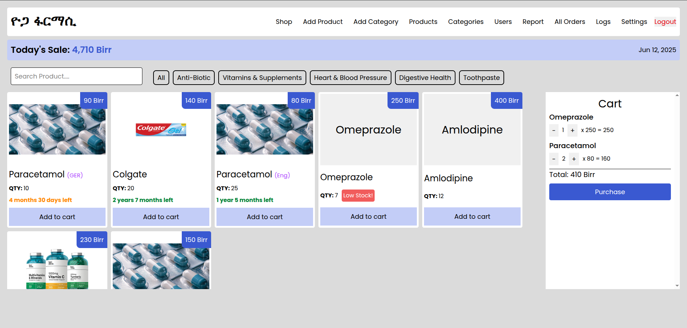
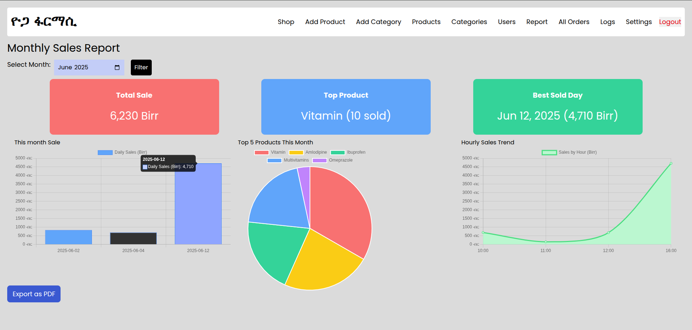
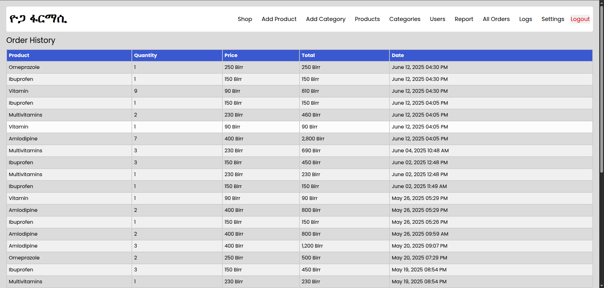
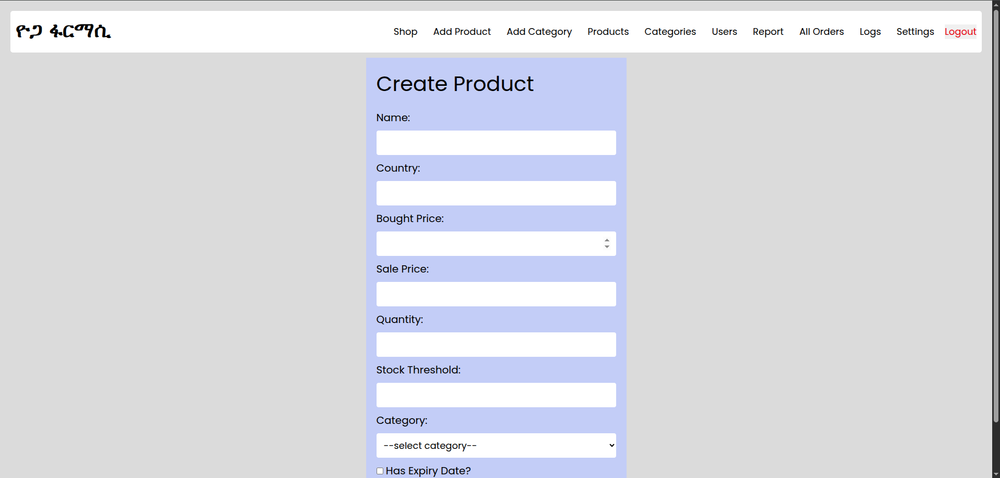

# 🛍️ Shop Management System (Laravel)

A full-featured Laravel-based application designed to streamline day-to-day shop operations — from product tracking to automated reporting with Telegram integration.


---

## 🚀 Features

✅ **Product Management**
- Register, edit, and delete products
- Auto low-stock alert sent via Telegram

📦 **Category Management**
- Create, update, and delete product categories

📈 **Reports**
- Daily sales tracking
- Monthly sales report (with filters)
- Export monthly reports (CSV or PDF)
- Visual graph statistics for trends

📤 **Telegram Integration**
- Daily report sent automatically as PDF to Telegram
- Low stock alerts in real-time

👤 **User Management**
- Add users with specific roles (admin, manager, etc.)
- Role-based access control

⚙️ **Customizable Settings**
- Easily update store preferences and configurations

---

## 📸 Screenshots

### 🧾 Dashboard


### 📈 Monthly Sales Graph


### 📤 Total Sale Log


### 📤 Creating a product



---

## 🧰 Tech Stack

- **Framework:** Laravel 10.x
- **Language:** PHP 8.1+
- **Database:** MySQL / MariaDB
- **Charting:** Chart.js
- **PDF Reports:** DomPDF
- **Telegram API:** Laravel Telegram Bot integration

---

## 🛠️ Installation

```bash
git clone https://github.com/YaredAb/shop-management.git
cd shop-management

# Install dependencies
composer install

# Setup environment
cp .env.example .env
php artisan key:generate

# Configure DB in .env
php artisan migrate --seed

# Serve the app
php artisan serve
